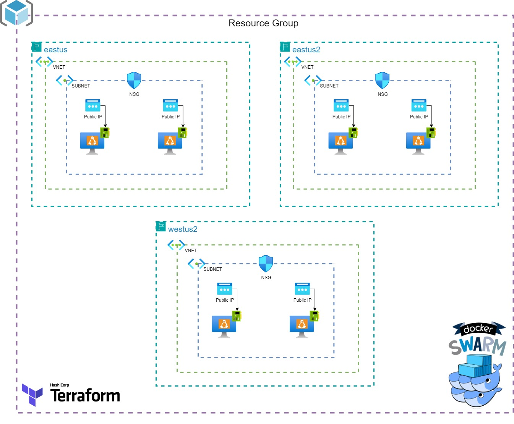

# Project
This Project was develop for deploy required infraestructure to set up a Docker Swarm Cluster on a Azure For Students Subscription

### Limitations of Azure for Students

This Subscription is limitated, so we can only deploy up to 4 VCPU's in one region and only three Public IP's per region.

# General Info

In this section, we will find all the files related to the development and implementation of the infrastructure, which was made with **Terraform.**

*It should be noted that all Terraform Code was made with oficial Hashicorp Providers*

# Infraestructure

In the following diagram it is represented all the infraestructure that i designed in this project.
It Represent each of the implemented services and how they relate to each other 

  

# Estructure

| Archivo                                                                                                            | Descripción |
|---------------------------------------------------------------------------------------------------------------------|-------------|
|[provider.tf](provider.tf)                                                                                         |     En este archivo definimos el Cloud Provider (Azure) junto con todas sus configuraciones. Definimos que se use siempre una version >= que la version 5.36.0 y que toda la infraestrcutura desplegada será en us-east-1 (virgina). Además utilizamos tags dentro de la definición del provider para identificar todos los recursos que sean desplegados con **Terraform** para que no se mezclen junto con los recursos que no fueron desplegados por la herramienta de **IaC**.   |
|[backend.tf](backend.tf)                                                                                             |     **backend.tf** contiene la configuración del almacenamiento del archivo **terraform.tfstate**. El mismo se encuentra almacenado en un bucket de S3 dentro de la cuenta de AWS. Esto nos permite proteger de cierta manera el archivo de estado ante cualquier error. No solo eso, sino que tenerlo almacenado en un bucket de S3 nos permite colaborar y trabajar en armonía con multiples colaboradores.     |
|[main.tf](main.tf)                                                                                                   |     Es el archivo principal en donde se encuentra la mayor parte del desarrollo de la infraestructura. Dentro de **main.tf** se encuentran todos los servicios que se utilizaron en esta solución. Cada servicio está desarrollado y configurado a partir de los módulos oficiales de **Terraform**.     |
|[resources.tf](resources.tf)                                                                                         |     **resources.tf** contiene recursos de **Terraform** aislados para complementar a los módulos de **Terraform** que se encuentran en **main.tf**. Dentro de este archivo encontraremos los recursos para pushear la imágen de docker de la apliación hacia el **ACR**. Recursos para desplegar para poder configurar y desplegar el Target Group y el Listener del **NLB** los cuales son necesarios para relacionar el **NLB** con el **ASG**. También encontraremos todos los recursos que se encargan de la creación de políticas, roles, NSG´s y Resource Groups.     |
|[data.tf](data.tf)                                                                                                   |     Este es un archivo dedicado al uso de los bloques **data** los cuales nos permiten obtener recursos, o información de los mismos, que ya se encuentran desplegados dentro de el Cloud Provider (AWS) y que fueron definidos por fuera de **Terraform**. Unicamente usamos un bloque data para obtener el arn del secret de la base de datos para luego usarlo en el archivo **locals.tf**.     |
|[variables.tf](variables.tf)                                                                                         |     **variables.tf** es el archivo dedicado para todas las variables que queramos definir dentro de **Terraform**. Unicamente se encuentran las variables de el nombre para la VPC y una variable para definir el ambiente en el que estamos trabajando.     |
|[locals.tf](locals.tf)                                                                                               |       En este archivo encontraremos un bloque **locals** general, que contiene una serie de expresiones almacenadas para luego ser utilizadas a modo de variables en el user data del recurso **auto_scaling_group**.     |

## Terraform Modules

Los **modulos** en terraform, son contenedores para multiples recursos que se usarán entre sí. Un módulo consiste en una colección de archivos **.tf** y/o **.json**
que se mantienen juntos en un directorio.

Nosotros podemos crear módulos o bien, tomar módulos que ya hayan sido creados. En cuanto a la segunda opción, Terraform puede cargar modulos desde un registro publico o privado. Esto permite publicar módulos para que otros los utilicen y utilizar módulos publicados por otros. Gracias a los modulos podemos aplicar el concepto de [DRY](https://es.wikipedia.org/wiki/No_te_repitas) (Don´t Repeat Yourself) para no repetir código que ya fué creado.

### Modulos utilizados

* [VPC](https://registry.terraform.io/modules/terraform-aws-modules/vpc/aws/latest)
* [VPN Gateway](https://registry.terraform.io/modules/terraform-aws-modules/vpn-gateway/aws/latest)
* [NLB](https://registry.terraform.io/modules/terraform-aws-modules/alb/aws/latest)
* [ECR](https://registry.terraform.io/modules/terraform-aws-modules/ecr/aws/latest)
* [RDS](https://registry.terraform.io/modules/terraform-aws-modules/rds/aws/latest)
* [EFS](https://registry.terraform.io/modules/terraform-aws-modules/efs/aws/latest)
* [ASG](https://registry.terraform.io/modules/terraform-aws-modules/autoscaling/aws/latest)
* [Security Groups](https://registry.terraform.io/modules/terraform-aws-modules/autoscaling/aws/latest) [(resources.tf)](resources.tf)

## Terraform Resources 

Además de los módulos, tuvimos la necesidad de utilizar recursos de **Terraform** aislados para poder satisfacer algúnas necesidades muy puntuales, ya que los módulos a veces carecen de algunas funcionalidades cuando se trata de realizar una función muy específica.

Estos recursos se encuentran centralizados en el archivo de [resources.tf](resources.tf).

### Null Resource

Este recurso denominado [null_resource](https://registry.terraform.io/providers/hashicorp/null/latest/docs/resources/resource) es muy similiar a un recurso estándar de Terraform, permitiendo adherirese al ciclo de vida de los recursos y sirve para ejecutar acciones que son independientes de **Terraform** sin aprovisionar ningún recurso fisico.

En este proyecto decidimos utilizar un **null_resource** para poder almacenar la imágen **Docker** de nuestra aplicación en el registry privado de AWS (**ECR**), el cual es creado previamente por un módulo de **Terraform** en [main.tf](main.tf)

Esto lo logra ejecutando tres comandos utilizando el aprovisionador de **local_exec** el cual nos permite ejecutar un comando de manera local.

+ 1er **local_exec** se realiza un login hacia el registry privado de **AWS**
+ 2do **local_exec** procedemos a tagear la imágen de nuestra aplicación
+ 3er **local_exec** pusheamos la imágen hacia el resitry privado de **AWS**

 *(**cabe aclarar que los comandos que se proporcionan para los local_exec son compatibles para ejecutarse bajo un entorno linux. Tener en cuenta esto antes de ejecutar el template**)*

### Aws_lb_target_group

Recurso dedicado a desplegar y configurar un [Target Group](https://docs.aws.amazon.com/elasticloadbalancing/latest/application/load-balancer-target-groups.html) para registrar el **ASG** y poder balancear la carga que provenga desde el **NLB** hacia todas las instancias vivas del **ASG**.
Para que esto se logre, este recurso es referenciado en el módulo de **Auto Scaling Group** y en el recurso de **aws_lb_listener**

### Aws_lb_listener
 Se encarga de brindar un [Listener](https://docs.aws.amazon.com/elasticloadbalancing/latest/application/load-balancer-listeners.html) para el **NLB** y a su vez define cómo va a manipular el tráfico. En este caso se configuró un **Target Group** para poder registrar todas las instancias del **ASG** y poder balancear el tráfico a dichas instancias.

### Aws_iam_policy

En este archivo también vamos a encontrar varios recursos dedicados a la creación de [IAM Policy's](https://docs.aws.amazon.com/IAM/latest/UserGuide/access_policies.html). 
Podemos encontrar 3 políticas distintas, donde cada una posee una breve descripción de su finalidad.
Los recursos que se encargan de crear estas políticas son:

+ **get_rds_secret**
+ **ecr_auth_login**
+ **manage_lifecycle**

### Security-Groups

También, encontraremos varios módulos de **Terraform** que se encargan de la creación de [Security Groups](https://docs.aws.amazon.com/vpc/latest/userguide/vpc-security-groups.html) para controlar el tráfico de todos los servicios que conforman la infraestructura.

### Aws_resourcegroups_group

Estos recursos de **Terraform** tienen como objetivo la creación de [Resource Groups](https://docs.aws.amazon.com/ARG/latest/userguide/resource-groups.html) para la agrupación de recursos, basados en el tipo de recurso.
Tenemos tres recursos de **Terraform** que crean los siguientes **Resource Groups**

+ **networking**
+ **compute**
+ **storage**

## User Data

Los **ASG** hacen uso del servicio **[EC2](https://docs.aws.amazon.com/AWSEC2/latest/UserGuide/concepts.html)**. Al final, estamos lanzando instancias EC2 pero que pertenecen logícamente a un grupo.

Al igual que en el servicio EC2, el ASG a la hora de desplegar una instancia, tiene la capacidad de hacer uso del **user-data**. Este es un script o una secuencia de pasos que se utiliza en el aprovisionamiento de la instancia, para realizar tareas de configuración automatizadas comunes e incluso ejecutar otros scripts, comandos o programar jobs.

De esta manera, nosotros pudimos darle toda la configuración de inicio a nuestro ASG. [Más informacion sobre la utilización del user-data.](./user-data/README.md)
