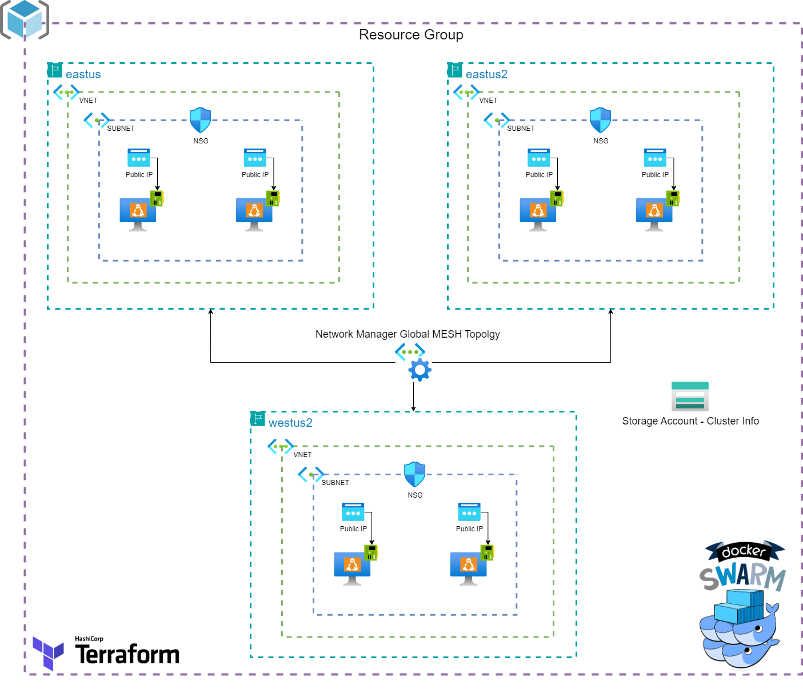
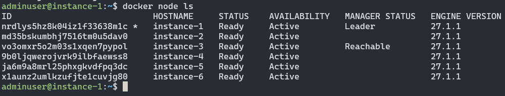

# Project
This Project was develop to deploy required infraestructure to set up a Docker Swarm Cluster on a Azure For Students Subscription

### Limitations of Azure for Students

This Subscription is limitated, so we can only deploy up to 4 VCPU's in one region and only three Public IP's per region.

# Challenge
Deploy ***Docker Swarm Cluster*** with more than 4 nodes

# Before you Begin

To execute this project correctly, it is recommended to follow these steps:

+ Install Terraform
+ Install the Azure CLI and log in to it to execute the project within an Azure subscription
+ Run the project in a Linux environment
+ Execute **terraform init** from */cluster*
+ Execute **terraform plan**
+ Then, **terraform apply**
+ After successful apply, you can run **terraform output -raw tls_private_key > secureadmin_id_rsa** to save the private_key into a file to connect to Virtual Machine's with SSH

# General Info

In this section, we will find all the files related to the development and implementation of the infrastructure, which was made with **Terraform.**

*It should be noted that all Terraform Code was made with oficial Hashicorp Providers*

# Infraestructure

In the following diagram it is represented all the infraestructure that i designed in this project.
It Represent each of the implemented services and how they relate to each other 

  

# Structure

| File                                                                                                            | Description |
|-----------------------------------------------------------------------------------------------------------------|-------------|
|[provider.tf](provider.tf)                                                                                        |     This file defines the Cloud Provider (Azure) along with all its configurations. We define that a version >= 3.113.0 should always be used.   |
|[main.tf](main.tf)                                                                                               |     This is the main file where most of the infrastructure development takes place. Within **main.tf**, you will find all the services used in this solution. Each service is developed and configured using the official **Terraform** modules.     |
|[variables.tf](variables.tf)                                                                                     |     **variables.tf** is the file dedicated to all the variables we want to define within **Terraform**.     |
|[perform-cluster.tf](perform-cluster.tf)                                                                         |    File that contain **null_resoruce**'s to perform the **Docker Swarm** cluster     |
|[network-mesh.tf](network-mesh.tf)                                                                               |     In this file, we will find all the resources necessary to create a **global MESH topology network** among all the Virtual Networks in all regions that contain the name "vnet". **Mesh topology** is a network configuration where devices are interconnected in a decentralized manner.    |
|[output.tf](output.tf)                                                                                           |     File dedicated to centralizing all the outputs used in this project.     |

## Terraform Resources 

These resources are centralized in the [main.tf](main.tf), [network-mesh.tf](network-mesh.tf), and [perform-cluster.tf](perform-cluster.tf) files.
### azurerm_resource_group
The resource group where all the resources deployed in this solution will be located.

### azurerm_virtual_network
Resource responsible for creating the Virtual Networks defined in the **vnets** variable. They will be created per region and will host each of the virtual machines.

### azurerm_subnet
Each Virtual Network will have a single subnet to assign virtual machines, NICs, and Public IPs.

### azurerm_storage_account, azurerm_storage_container and azurerm_storage_account_sas
These three resources are intended for creating a Storage Account, which aims to store the tokens of the **Docker Swarm** cluster.

### azurerm_public_ip
The public IPs to access each of the virtual machines.

### azurerm_network_interface
The network interface, which will be attached to each of the VMs and each of the Public IPs.

### azurerm_network_security_group
One NSG will be deployed for each subnet in each Virtual Network to allow internet traffic from the VMs and enable SSH connection.

### azurerm_subnet_network_security_group_association
To associate the NSGs with their corresponding Subnet.

### tls_private_key
This resource generates the same pair of keys, both public and private, for each virtual machine. This pair of keys gives us the ability to connect to each of the virtual machines via SSH.

### azurerm_linux_virtual_machine
Resource responsible for deploying each of the virtual machines specified in the **instance_set** variable.

### Null Resource

This resource, called [null_resource](https://registry.terraform.io/providers/hashicorp/null/latest/docs/resources/resource), is very similar to a standard Terraform resource, allowing it to adhere to the lifecycle of resources and serves to execute actions independent of **Terraform** without provisioning any physical resource.

In this project, I decided to use several **null_resource** to initialize the **Docker Swarm** cluster and add each of the Virtual Machines to it.

+ **sleep** This **Null Resource** aims to execute a **local_exec** to perform a 300ms (5 minutes) sleep. I do this to wait for all the custom_data of each Virtual Machine to execute and avoid issues when running **Docker** or **AzCopy** commands.
+ **docker_swarm_up** Aimed at creating the **Docker Swarm** cluster. It iterates over each of the Virtual Machines declared in the **instance_set** variable, looking for the one defined with its *node-type* as **main**. When it finds it, it executes the specific Docker command to initialize the **Docker Swarm** cluster (using a **remote-exec**). For the other Virtual Machines, it only performs an *echo* of their *node-type*. This same **null_resource** depends on the **null_resource** **sleep**.
+ **upload_data** Resource responsible for finding the Virtual Machine with *node-type* **main**, stores the tokens locally within the Virtual Machine via **remote-exec**, and pushes them to the previously created Storage Account for the project. 
+ **download_data** is a null_resource that pull the files that cotian the docker swarm tokens from Storage Account, it save the values to environment variables and execute the docker command to join to the **Docker Swarm** cluster

 *(**It should be noted that the commands provided for local_exec are compatible to run in a Linux environment. Keep this in mind before executing the template.**)*

## Custom Data

This is a script or a series of steps used during the instance provisioning process to perform common automated configuration tasks and even execute other scripts, commands, or schedule jobs.

With **Custom Data**, through the script [docker.sh](/cluster/custom_data/docker.sh), I install **Docker** and **AzCopy** so that when the machines are created, these two tools are already installed.

# Example
Whit Default variables (6 vm's and 3 vnets in 3 different regions)

If terraform apply was succesfull, when we connect to the **main vm** (Virtual Machine that initialize the **Docker Swarm** Cluster) and execute *docker node ls* we should see:

  

